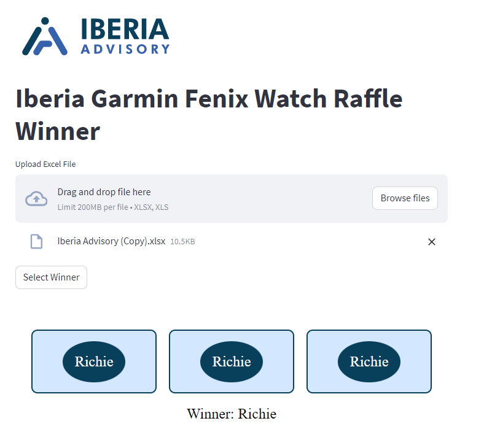

# Iberia Garmin Fenix Watch Raffle

This Streamlit application conducts a raffle to select a winner from a list of participants for the Iberia Garmin Fenix Watch giveaway. Participants can be entered manually or uploaded via an Excel file.

## Features

- Upload participant names from an Excel file.
- Enter participant names manually.
- Visually appealing slot machine animation to select and display the winner.

## Requirements

- Python 3.6 or higher
- Streamlit
- pandas
- openpyxl (for reading Excel files)

## Usage

1. Ensure you have the Iberia logo image at ./Images/iberia-logo.png. You can change the path to your logo if necessary.

2. Run the Streamlit application:

        streamlit run raffle_app.py

######

3. Follow the instructions in the web interface:

- Upload an Excel file with participant names, or
- Enter participant names manually (one per line).

4. Click the "Select Winner" button to start the raffle.

## File Structure

- RandomWinner.py: Main application file.

- ./Images/iberia-logo.png: Logo image displayed in the app.

## Sample Excel File

Your Excel file should have a column named "My name is..." containing the participant names.

Example:

My name is...

Richie

Brian

Casey

## Screenshots

